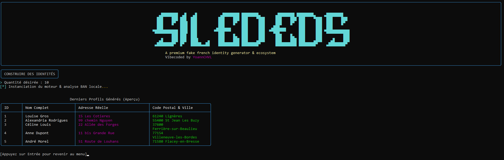
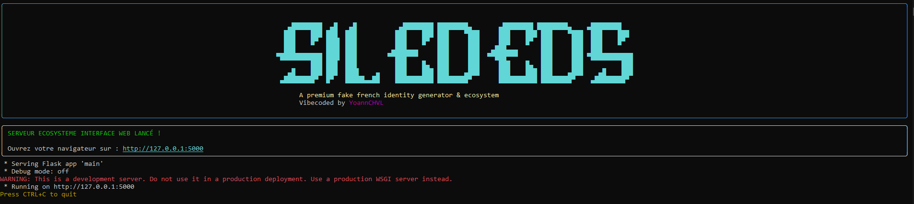
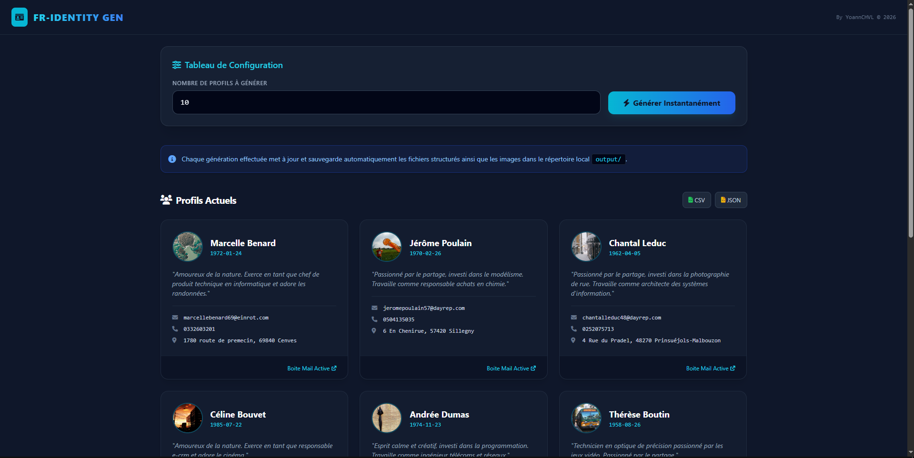

# 👤 Silededs - Fake Profile / Identity Generator

Generate fictional French profiles with avatars, realistic bios and complete personal information in just a few seconds.

This tool generates:

* 🇫🇷 French first & last names
* 🏠 Realistic addresses (from the real French address database)
* 📱 Phone numbers
* 📧 Temporary working email addresses
* 🎂 Birth dates
* ✍️ Realistic bios (auto-generated)
* 📸 Profile pictures
* 💾 CSV & JSON exports

> ⚠️ All generated profiles are fictional and intended for development, testing and educational purposes only.

## 📸 Screenshots

### Main Menu


### CLI Generation


### Web Interface


### Web Generation


## 🚀 Features

* Realistic French profiles with real street addresses
* Automatic bio generation (no separate step needed)
* Automatic avatar download & crop
* Multi-threaded image downloading
* CSV & JSON export
* Terminal & Web interface

## 📦 Requirements

* Python 3.9+
* Requests
* Pillow
* Faker

Install everything with:

```bash
pip install -r requirements.txt
```

## 📥 Before you start

**You need to download the French address database (BAN) first.**

This step is mandatory because the tool generates real streets and postal codes from the official French government database.

```bash
python download_all_ban.py
```

> ⚠️ This will download approximately **890MB** of compressed data (all French departments).  
> The download may take a few minutes depending on your internet connection.
> If downloading them takes time, do not worry and just let the program do its work. Even if there is error, the program will retry to download theses datas at the end.

The files will be saved in `input/ban_compressed/`.

## 📝 Usage

Run the main script:

```bash
python main.py
```

1. Select option 1 (CLI) or option 2 (Web interface)
2. Enter the number of profiles you want to generate
3. Profiles are automatically generated with bios, avatars, and real addresses
4. Everything is saved in the `output/` folder

## 🌐 Web Interface

You can also use the web interface:

```bash
python main.py
# Then select option 2
```

Then open your browser at `http://127.0.0.1:5000`

**Important:** When you generate new profiles from the web interface, the previous profiles and avatars stored in `output/` are automatically deleted and replaced. The tool keeps only the latest generated batch.

## 📁 Output Structure

```
output/
├── avatars/          # Profile pictures (JPEG)
└── profiles/
    ├── profiles.csv  # All profiles in CSV format
    └── profiles.json # All profiles in JSON format
```

## ❤️ Credits

* Faker
* Pillow
* Requests
* Unsplash Metadata
* Visual Genome Dataset
* BAN (Base Adresse Nationale) - French government open data

## 💻 Vibecoded

This project was **vibecoded** by **YoannCHVL**, I was so lazy but still wanted to create this project so I used AI..

## ✨ Contact

If you have any questions, recommendations.. feel free to DM me!  
Discord: **wdx0**

---

## ❤️ Donation

**LTC**

`LMvsjN9RkZSD3Da2QMuMizBx1NNn7s18Sj`

**BTC**

`bc1qyc6q4n4rmhcnajvsuztf9eurw7hz2fuskdm2hg`

**ETH**

`0x0974f67183C7e3C3FeE622B2EfE255090F83157b`

---

© 2026 YoannCHVL. All rights reserved.